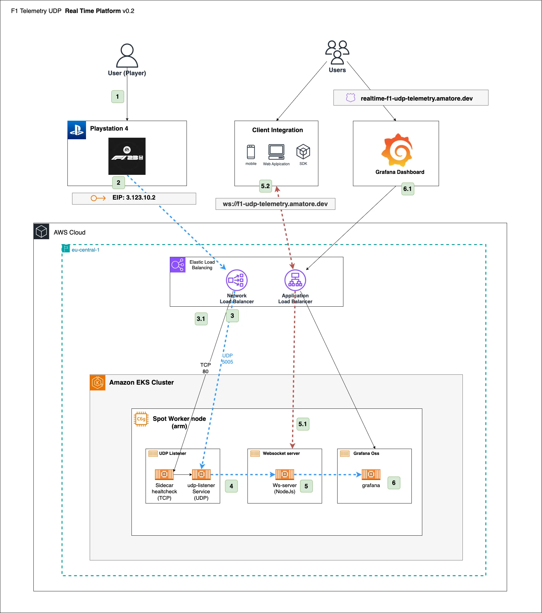
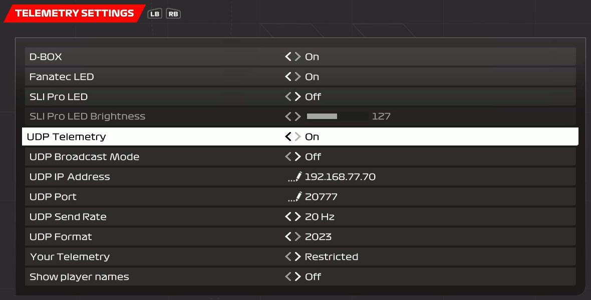

# AWS EKS UDP Telemetry Pipeline
This project demonstrates a real-time data ingestion pipeline using AWS EKS to process UDP telemetry data from 
the F1 2023 PlayStation 4 game. It is designed for scalability, cost-efficiency, and performance using AWS managed services.

<!-- TOC -->
* [AWS EKS UDP Telemetry Pipeline](#aws-eks-udp-telemetry-pipeline)
  * [Overview](#overview)
    * [Architecture](#architecture)
      * [Key Components](#key-components)
      * [Workflow](#workflow)
    * [Project Structure](#project-structure)
    * [Installation/Setup](#installationsetup)
      * [Prerequisites](#prerequisites)
      * [Deployment](#deployment)
      * [Playstation 4 Configuration](#playstation-4-configuration)
      * [Local Testing](#local-testing)
      * [Option 1. Using docker compose (recommended)](#option-1-using-docker-compose-recommended)
      * [Option 2. Using docker compose (recommended)](#option-2-using-docker-compose-recommended)
  * [Demo / Showcase](#demo--showcase)
<!-- TOC -->

## Overview

### Architecture
High-level architecture diagram of the solution:


#### Key Components

- PlayStation 4 with F1 2023: Sends real-time telemetry data via UDP to a specific IP and port. The game allows for the data to be broadcast to the entire network or to a targeted endpoint.

- EKS Cluster: Deployed in the eu-central-1 region via AWS CDK (EKS Blueprints). The cluster is composed of spot instances, specifically ARM-based C6g instances.

- Network Load Balancer (NLB): Exposes the UDP listener service to the public internet, mapping to a static Elastic IP.

- Application Load Balancer (ALB): Provides secure access to the WebSocket server for external clients and to Grafana for real-time telemetry visualization.

- UDP Listener Service: Receives telemetry data from the PlayStation and processes the UDP packets according to the F1 game’s telemetry specification. A sidecar service (Nginx) performs TCP health checks to ensure availability.

- WebSocket Server: Publishes the telemetry data to connected clients. For this project, only speed data is transmitted.

- Grafana OSS: Configured with a WebSocket plugin to allow real-time visualization of telemetry data, enabling users to monitor key metrics like vehicle speed.

#### Workflow

The diagram has been labeled with the main workflow process for telemetry ingestion. The different steps have been brifly explained next:

1. The PlayStation 4 with F1 2023 sends UDP telemetry data to the Elastic IP associated with the Network Load Balancer.

2. The NLB forwards this data to the UDP listener service running on AWS EKS.

3. A sidecar TCP health check ensures the UDP listener's availability by monitoring the service.

4. The UDP listener processes the telemetry data and forwards it to the WebSocket server.

5. The WebSocket server broadcasts the telemetry data to connected clients.

6. Grafana, connected via the WebSocket plugin, visualizes the data, providing real-time insights into the car's speed.

### Project Structure
```
    ├── manifests                 <-- Kubernetes manifests for the project          
    ├── resources                 <-- Internal resources required for the project
    ├── src                       <-- Root folder for the source code of the project
    │   └── udp-listener-service  <-- Unit tests
    │   └── websocket-server      <-- Lambda funtions handlers implementation
    ├── udp-eks                   <-- AWS CDK resources required implemented in typescript
    ├── compose.yaml              <-- Docker compose file to deploy the project locally 
    └── README.md                 <-- This instructions file
```

### Installation/Setup
The setup covers both the cloud infrastructure and the necessary 
configuration on your PlayStation to send telemetry via UDP to the system.

#### Prerequisites
- AWS Account: You'll need an AWS account to deploy the cloud infrastructure.
- AWS CLI: [Install and configure the AWS CLI](https://docs.aws.amazon.com/cli/latest/userguide/install-cliv2.html) with appropriate permissions to deploy resources in your AWS account.
- CDK (AWS Cloud Development Kit): Ensure [CDK](https://docs.aws.amazon.com/cdk/v2/guide/getting_started.html) is installed locally for deploying the EKS cluster and associated resources.
```
npm install -g aws-cdk
```
- Node.js: Required to run the CDK. [Node.js Installation Guide](https://nodejs.org/)
- PlayStation 4: With F1 2023 game installed and configured to send telemetry.
- Minikube & ArgoCD (Optional): For local testing before deploying to AWS. ([Minikube Installation](https://minikube.sigs.k8s.io/docs/start/?arch=%2Fmacos%2Fx86-64%2Fstable%2Fbinary+download)
        /[ArgoCD Installation](https://argo-cd.readthedocs.io/en/stable/operator-manual/installation/))

#### Deployment
- Start by cloning the repository to your local environment:
```
git clone https://github.com/acriado-dev/aws-eks-udp-telemetry.git
cd aws-eks-udp-telemetry
```

- As this project uses AWS CDK and EKS blueprints to set up the cluster, follow these steps to deploy:

1. Bootstrap the environment (if necessary): If this is the first time you're deploying with CDK in the region, run:
```
cdk bootstrap aws://<ACCOUNT_ID>/<REGION>
```
2. Deploy the EKS Cluster: Run the CDK deployment command to create the EKS cluster and related resources such as Spot instances and load balancers:

```
cdk deploy --all
```

3. Deploy UDP Listener, WebSocket Server, and Grafana by applying the kustomize overlay

```
(base) ~/Documents/GitHub/aws-eks-udp-telemetry/manifests/overlays/develop git:[main]
kubectl apply -n real-time-udp-telemetry -k ./
configmap/configmap-real-time-udp-listener created
configmap/configmap-real-time-websocket-server created
configmap/general-cfg created
secret/general-secret created
service/real-time-udp-listener-service created
deployment.apps/real-time-udp-listener created
deployment.apps/real-time-websocket-server created
```
4. Configure Network Load Balancer with Elastic IP
   After deployment, configure the NLB to ensure the Elastic IP is associated with the UDP Listener. This setup will route the incoming telemetry data from your PlayStation to the UDP listener pod in the EKS cluster.


#### Playstation 4 Configuration
To generate and send UDP telemetry data from the F1 2023 game, follow these steps:

1. Enable Telemetry in F1 2023 Game: Open the settings in the F1 2023 game and enable UDP Telemetry. This will allow the game to broadcast telemetry data while you're playing.
2. Configure IP and Port: Set the IP and Port in the telemetry settings to match the Elastic IP assigned to the Network Load Balancer (NLB) in your AWS deployment.





#### Local Testing
To test the project locally, you have two options:

#### Option 1. Using docker compose (recommended)
Deploy locally UDP listener, WebSocket server, and Grafana using Docker Compose. You will configure your PlayStation 
to send telemetry data to your local IP.

- Ensure that [Docker desktop](https://docs.docker.com/desktop/) is installed locally and running
- Review and Adjust configuration to point localhost when required.
- Configure Playstation 4 to point to your local IP by updating the telemetry settings
- Start the Docker containers:
```
docker-compose -f compose.yaml up
```
- Access Grafana in [http://localhost:3000] with initial credentials admin/admin
- Install the [Websocket API Data source plugin](https://grafana.com/grafana/plugins/golioth-websocket-datasource/) 
- Configure the datasource endpoint as your local websocket server
- Create a custom dashboard with a gauge component to visualize the data source created 


#### Option 2. Using docker compose (recommended)
Minikube to simulate a Kubernetes environment locally, managed with ArgoCD to sync your local environment with the repository.

- Ensure that Minikube and ArgoCD are installed in your machine
- Start Minikube:
```
minikube start --cpus=4 --memory=8192
```

- Install ArgoCD:
```
kubectl create namespace argocd
kubectl apply -n argocd -f https://raw.githubusercontent.com/argoproj/argo-cd/stable/manifests/install.yaml
```

- Expose ArgoCD Dashboard:
```
kubectl port-forward svc/argocd-server -n argocd 8080:443
```

- Access the ArgoCD dashboard on [http://localhost:8080] with default credentials
- Create and configure this current repository or your forked version in ArgoCD
- Create a new Application in ArgoCD pointing the repo and the `/manifests/overlays/develop` folder
- In the Application make sure that your local minikube cluster is the target
- Sync the application to create the resources defined in the different manifests.
- Expose the services:
```
minikube service <service-name>
```
- Configure Playstation4 to point to your local IP
```
minikube ip
```
- Generate data by playing some race in the game and monitor the logs or configure Grafana Dashboard.


## Demo / Showcase
[](https://www.youtube.com/watch?v=ILYCQ5PZYwk)
